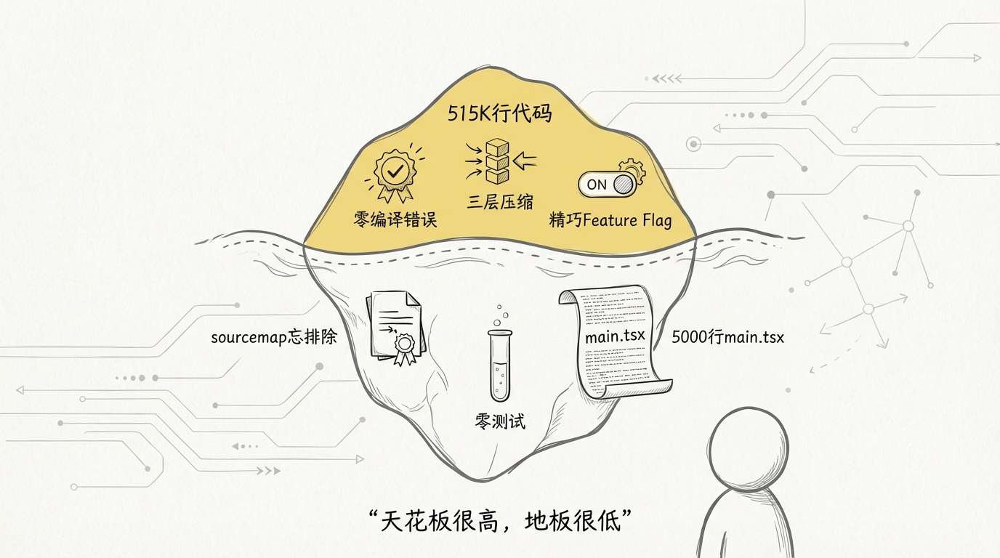
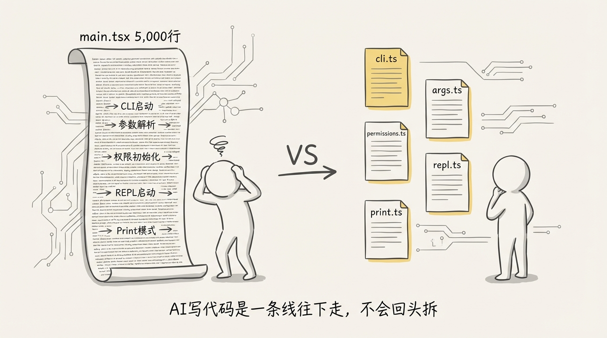
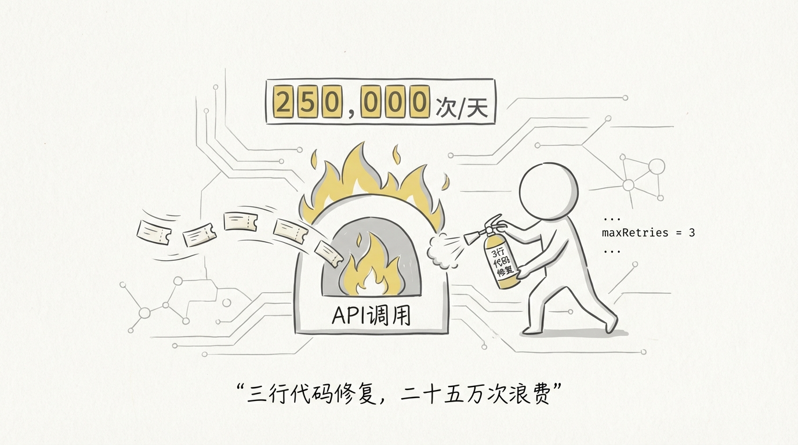
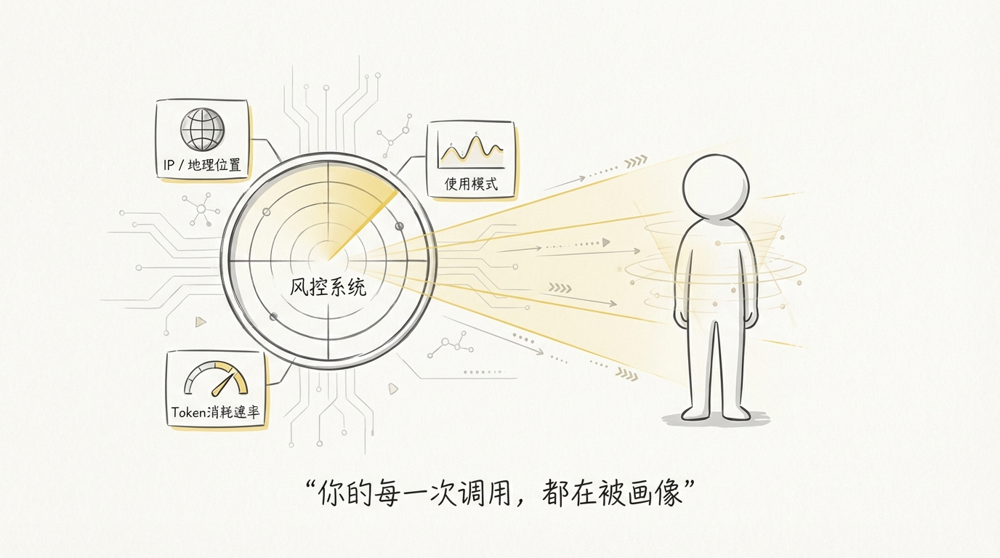
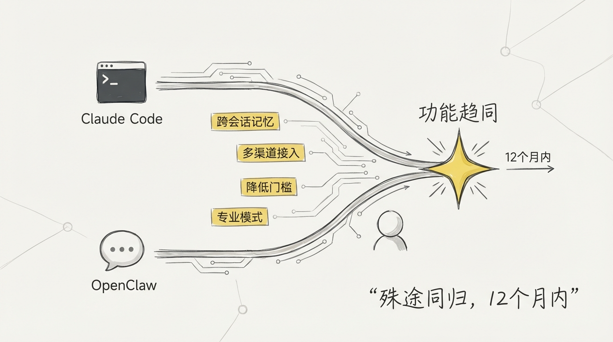

[English](docs/13-Source-Code-Findings.md)

# 13 啃完 51 万行源码的发现，与 Claude 的封号机制

## 正经分析之外的东西




前面 12 篇文档都在正经地拆解架构和模块，这篇聊点不一样的，聊那些藏在代码角落里的、让我哭笑不得的发现。同时也结合源码聊聊 Claude 的封号机制。

## 1️⃣ 关于这份源码的来源

需要先澄清一个背景，你在 GitHub 上看到的关于Claude Code的仓库，都不是 Anthropic 的原始仓库，而是一个开发者从 sourcemap 还原出来之后 fork 的版本。

还原出来的代码缺少构建脚手架，没办法直接跑。这位开发者做了一系列修复工作让它能一次性编译通过，仓库里的几十个 commit 大部分是对构建流程的修复，包括补全缺失的类型定义、修复编译错误、清理 any 标注等。

**所以这些 commit 记录反映的是修复者的工作，不代表 Anthropic 原始的开发历史。** Anthropic 内部的开发流程、commit 规范、合并&发布流程、是否使用 AI 辅助编码，我们从这个仓库里看不到。

## 2️⃣ 源码泄露本身就是 AI 工程化短板的证据

整个源码之所以泄露，就是因为发布到 npm 时 sourcemap 文件没有被排除。

AI 把功能写得完美无缺，类型标注零错误，错误处理滴水不漏。但在发布配置这种工程化的小事上翻车了。它不会主动想到：构建产物里有没有不该出现的文件？`.npmignore` 配置对不对？发布前要不要做一次产物审查？

**AI 是一个能力极强但纪律性极差的工程师。** 天花板很高，但地板也很低。它只做你要求它做的事，不会主动做你没要求但应该做的事。

## 3️⃣ main.tsx 一个文件 5,000 行




塞了 CLI 启动引导、参数解析、权限初始化、REPL 启动、print 模式、各种子命令，正常工程实践应该会拆成五六个模块。

AI 写代码像写作文，一口气从头写到尾。人写代码像搭乐高，先想好模块再拼。

AI 不会主动拆文件，因为拆文件意味着要跨文件维护导入关系，这对 AI 来说是更难的任务。

## 4️⃣ 自动压缩曾经每天烧掉 25 万次 API 调用




代码注释里有一条生产教训，标注日期 BQ 2026-03-10：

1,279 个 session 出现了 50 次以上的连续压缩失败，最高一个 session 连续失败了 **3,272 次**。每次失败都会重试，全球每天浪费约 25 万次 API 调用。

解决方案就三行代码：连续失败 3 次就停止重试。

**没有重试上限的自动化流程就是一颗定时炸弹。** 这条经验放在任何系统里都成立。

## 5️⃣ 82 个 Feature Flag 全部 hardcode 为 false

```typescript
const feature = (_name: string) => false;
```

一行代码把所有未发布功能关掉，Bun 打包时做 dead code elimination，被 flag 包裹的代码直接从构建产物中删除。

**但源码里这些代码还在。** 你能看到 Anthropic 正在开发的所有功能：Kairos 自主模式、Context Collapse 上下文折叠、Voice Mode 语音交互、Verification Agent 自动验证。一家最顶尖 Agent 公司的技术蓝图，明文写在代码里。

## 6️⃣ 压缩摘要用了一个精妙的 prompt 技巧

压缩时要求模型先在 `<analysis>` 标签里做分析，再在 `<summary>` 标签里写摘要。最终只保留 summary，analysis 丢弃。

让模型先想清楚再总结，但不浪费上下文空间。思考过程是一次性草稿纸，用完就扔。这个技巧简单但有效，值得所有做 Agent 的人学习。

## 7️⃣ 583 个依赖

一个 CLI 工具，583 个 npm 依赖。AI 写代码遇到问题先 npm install，能用第三方库解决的绝不手写。人会权衡这个功能 20 行代码就能搞定，有没有必要引一个万行的库，而 AI 不做这个权衡。

**每多一个依赖就会让整个系统膨胀一点，也多一个供应链攻击面。**

## 从源码看 Claude 的封号机制




这是很多国内用户关心的问题，为什么用 Claude 容易被封号？源码里给出了一些线索。

**客户端上报了大量遥测数据。** 代码中有大量 `logEvent` 调用，上报的信息包括但不限于：

- 每次 API 调用的 token 消耗、耗时、模型选择
- 工具调用的类型、频率、成功率
- 权限模式的使用情况
- 压缩触发的次数和原因
- session 的时长和交互模式
- 错误类型和频率

这些遥测数据会发送到 Anthropic 的后端。虽然模型推理在服务端，但客户端的行为模式数据也在被收集。

**和封号直接相关的几个推测：**

**IP 和地理位置检测。** Claude Code 在启动时会检测网络环境。代码里有对 API endpoint 的健康检查，如果你通过代理访问，代理的稳定性、IP 的地理位置、请求延迟模式都可能被记录。频繁切换不同国家的 IP 是最容易触发风控的行为。

**使用模式异常检测。** 正常用户的使用模式有规律性：工作时间活跃、有思考间隔、工具调用类型多样。如果你的使用模式像一个自动化脚本，比如 24 小时不间断调用、每次调用间隔精确一致、只用同一种工具，后端的风控系统可能会标记你。

**Token 消耗速率。** 代码中有 `TOKEN_BUDGET` 和 `TASK_BUDGETS` 这两个 feature flag，说明 Anthropic 在做用量级别的预算管理。如果你的 token 消耗速率远超正常用户的分布，也是一个风控信号。

**为什么国内用户更容易被封？**

1. **代理 IP 问题。** 国内用户必须通过代理访问。大部分代理用的是机房 IP，同一个 IP 背后可能有几十上百个用户。Anthropic 的风控系统看到一个 IP 发出大量请求，会把这个 IP 标记为可疑
2. **IP 频繁切换。** 很多代理工具会自动切换节点，你可能五分钟前在日本、五分钟后在美国。正常用户不会这样，风控直接触发
3. **支付信息和注册信息不匹配。** 用虚拟信用卡注册，卡的 billing address 在美国，但实际使用 IP 在东南亚，这种不一致会被标记
4. **共享账号。** 多人共用一个账号，使用时间覆盖 24 小时不间断，使用模式极度不一致

**降低封号风险的实操建议：**

- 使用固定的住宅 IP 代理，不要频繁切换节点
- 保持 IP 和注册/支付信息的地理一致性
- 不要共享账号
- 使用模式尽量接近正常用户：有工作有休息，不要 24 小时不停

## Agent 的未来走向




啃完这份源码，再结合我自己基于 OpenClaw 搭建内部 Agent 平台的经验，对 Agent 的未来走向有一些判断。

**Claude Code 正在向平台化演进，而它的演进路径和 OpenClaw 这类 Agent 平台的设计哲学高度重合。**

先说最明显的一个信号：跨 session 记忆。源码中的 MEMORY.md 机制已经实现了基础版的跨会话记忆持久化，EXTRACT_MEMORIES 和 TEAMMEM 这两个 feature flag 说明 Anthropic 正在做两件事——自动记忆提取和团队记忆共享。这和 OpenClaw 的设计思路完全一致：Agent 不应该每次启动都是一张白纸，它需要记住用户是谁、偏好什么、上次做到了哪里。OpenClaw 很早就通过 COS 存储实现了实例级的状态持久化，Claude Code 现在也在往这个方向走，只是路径不同——一个是文件系统，一个是对象存储。

第二个信号是原生渠道接入。2025 年 3 月 20 日，Claude 已经能通过 MCP 插件接入 Telegram。这意味着 Agent 不再局限于终端里等用户来找它，而是可以主动存在于用户日常使用的通讯工具中。OpenClaw 从第一天起就是围绕渠道设计的——微信、企业微信、Slack、Discord，Agent 在哪里取决于用户在哪里。Claude Code 现在也开始理解这一点。可以预见，未来 Claude Code 会原生支持更多渠道，而不仅仅是通过 MCP 做桥接。WhatsApp、Line、飞书，这些都是时间问题。

第三个信号是使用门槛的持续下降。看 Claude Code 的产品迭代方向，从需要手动配置 API key 到一键登录，从纯命令行到 VS Code 集成，从需要自己写 CLAUDE.md 到自动记忆提取。每一步都在降低 bar。终极目标很清晰：**让不懂技术的人也能用 Agent 做事。** OpenClaw 的 Skills 市场就是这个思路的极致体现——用户不需要理解 prompt engineering，选一个现成的 Skill 就能用。Claude Code 的 Skills 体系已经在做同样的事。

但降低门槛不意味着牺牲上限。这是第四个判断：**对于高级用户，Agent 平台会提供越来越多的专业模式。**

Claude Code 源码中的 82 个 feature flag 就是证据。普通用户用默认配置就够了，但有能力的用户可以通过 flag 组合解锁完全不同的使用体验：自定义压缩策略、调整权限模式、配置 MCP 工具链、编写 Hooks 做流程自动化。这种分层设计——入门简单、进阶深邃——是所有成功的开发者工具的共同特征。Git 是这样，Vim 是这样，Kubernetes 也是这样。

OpenClaw 的 Planner-Executor 架构和 Claude Code 的 ReAct 循环，本质上解决的是同一个问题：如何让 Agent 在复杂任务中保持可控。OpenClaw 用 DAG 做任务编排，Claude Code 用 AsyncGenerator 做工具循环。实现不同，但设计哲学是相通的——**给 Agent 自主权，但永远保留人的介入点。**

我的判断是：未来 12 个月内，Claude Code 和 OpenClaw 这类平台会在功能上快速趋同。Claude Code 会变得更像一个平台（多渠道、持久记忆、团队协作），OpenClaw 会变得更智能（更强的模型、更好的推理能力）。最终的竞争不在于谁的模型更强或者谁的功能更多，而在于谁能在**降低使用门槛**和**提升能力上限**之间找到最好的平衡。

## 最后的思考

这些发现让我对 AI Coding 有了更具体的认知。

AI 能写出 51 万行零编译错误的代码，但会忘记排除 sourcemap。能做出精妙的三层压缩体系，但测试一行都没有。能设计出优雅的 feature flag 机制，但一个文件塞 5,000 行不觉得有问题。

**这恰恰定义了人在 AI Coding 时代的价值：安全判断、工程纪律、全局视角。** 这些事 AI 做不好，而且短期内看不到做好的可能性。

那些觉得 AI 会取代工程师的人，看完这份源码应该可以安心了。AI 写的代码确实很好，但离能自己发布上线，还差一个懂工程的人。
